## 1) Tabla comparativa (Motoman MH6, ABB IRB140, EPSON T3-401S)

A continuación se presenta una tabla comparativa de las especificaciones técnicas de los manipuladores:  EPSON T3-401S, Motoman MH6 y el ABB IRB140.

| **Característica** | **Motoman MH6** | **ABB IRB 140** | **EPSON T3-401S** |
|--------------------|------------------|------------------|--------------------|
| **Tipo / Ejes** | 6-ejes articulado | 6-ejes articulado | 4-ejes SCARA (T-series) |
| **Carga máxima** | 6 kg (MH6 estándar; existe MH6-10 de 10 kg) | 6 kg (IRB 140). Alcance 810 mm (hasta eje 5). | 3 kg (payload), alcance horizontal ~400 mm; eje Z stroke ≈150 mm; repetibilidad 0.02 mm |
| **Alcance (aprox.)** | Hasta ~1.4 m (depende versión / montaje) | 810 mm (documentado IRB140) | 400 mm brazo; Z 150 mm |
| **DOF (grados libertad)** | 6 DOF | 6 DOF | 4 DOF (θ1, θ2, Z, U rotación herramienta) |
| **Velocidad / ciclo** | Ejes rápidos — diseñado para alta velocidad (datos por eje en ficha) | Alta aceleración / ciclos rápidos apto para montajes y machine tending | Ciclo estándar ~0.54 s (depende del ciclo). Max. speed ejes T3 según ficha |
| **Precisión / repetibilidad** | ≈0.08 mm (varía por modelo y configuración) | Alta precisión; repetibilidad depende la configuración del IRB140 | ≈0.02 mm (T3 series) |
| **Montaje** | Suelo / pared / invertido (según restricciones de modelo) | Suelo / pared / invertido (flexible) | Mesa / sobremesa (tabletop) / integrado (modelo All-in-One) |
| **Aplicaciones típicas** | Ensamblaje, manipulación, dispensado, mecanizado ligero, soldadura ligera | Soldadura, ensamblaje, manipulado, machine tending, pulido | Ensamblaje, pick & place, paletizado ligero, piezas pequeñas, integrable con visión |
| **Controlador / Software** | Yaskawa controller (DX100 / MP series); soporte para programación offline | ABB IRC5; programación RAPID (RobotStudio) | Controlador RC700/RC90 con EPSON RC+ 7.0; lenguaje SPEL+; integración USB/Ethernet |

> *Nota:* Las fichas técnicas y manuales oficiales de donde se obtuvo la información se encuentran en la carpeta DOCS

## 2) Configuraciones de Home en EPSON T3-401S
El manipulador EPSON T3-401S utiliza encoders absolutos y relativos simultáneamente para determinar la posición angular de cada articulación.

- El encoder absoluto conserva la posición incluso después de apagar el robot.
- El encoder relativo mide desplazamientos desde un punto de referencia durante la operación.

El sistema define su Home en términos de pulsos del encoder (no en grados ni milímetros), según el manual oficial de EPSON, la posición Home estándar coloca todas las articulaciones del robot en 0 pulsos, lo cual representa la configuración geométrica de referencia establecida por fábrica. Sin embargo, en este laboratorio se definió una disposición de Home alternativa, diferente a la del manual, debido a que el Home original limitaba el rango de movimiento lateral y generaba posiciones menos prácticas para la manipulación de objetos. Con el nuevo Home, el robot obtiene un mayor alcance útil hacia ambos lados, especialmente para tareas que requieren desplazamiento amplio sobre la mesa de trabajo. A continuación se presenta la tabla con las posiciones de cada una de las articulaciones en el Home de fábrica: 

| Articulación | Pulsos de Home | Descripción de la posición |
|--------------|--------------------------|-----------------------------|
| **J1**       | 0                        | Brazo 1 orientado hacia el eje +X del robot |
| **J2**       | 0                        | Brazo 2 alineado con Brazo 1 (colineares) |
| **J3 (Z)**   | 0                        | Eje vertical Z en su punto superior (retraído) |
| **J4 (U)**   | 0                        | Herramienta orientada hacia el extremo del brazo 2 (rotación neutra) |

A continuación se presenta la imagen del robot con la orientación de home de fábrica: 

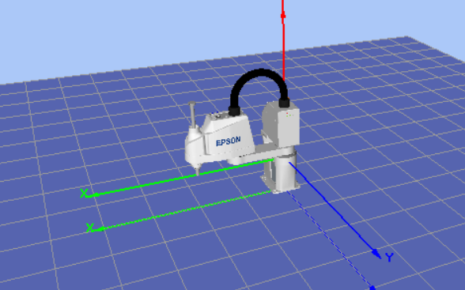

> Esta es la configuración Home **por defecto de fábrica**, utilizada como referencia interna por el controlador.

### Home alternativo definido en el laboratorio

Durante el laboratorio, se implementó un **Home alternativo** debido a que el Home original limitaba el rango de trabajo lateral del robot. El nuevo Home permitió un rango de desplazamiento mayor y más equilibrado hacia ambos lados, facilitando tareas como la manipulación de bandejas y trayectorias amplias. A continuación se presenta una imagen del home alternativo:

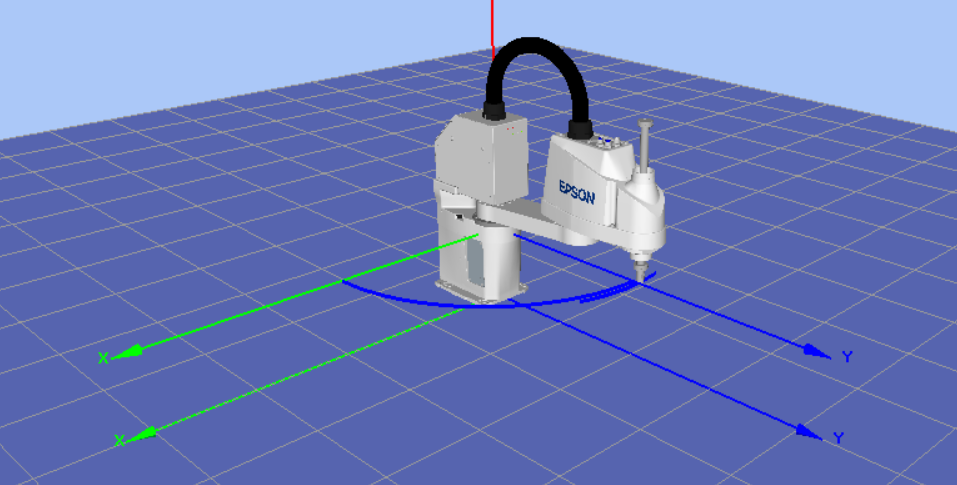

Valores del Home alternativo configurado:

- **J1 = 204800 pulsos**  
- **J2 = 0**  
- **J3 = 0**  
- **J4 = 0**

Orden de homing asignado:

- **J1 → Step 2**  
- **J2 → Step 2**  
- **J3 → Step 1**  
- **J4 → Step 2**

Esta disposición redefine la orientación inicial del robot, posicionándolo de manera más centrada y aprovechando mejor el espacio de trabajo, tal como se evidencia en la simulación 3D utilizada durante la práctica.

## 3) Procedimiento detallado para movimientos manuales (Teach Pendant / EPSON RC+)

Este apartado describe cómo operar el robot manualmente, tanto usando el teach pendant como el software EPSON RC+ 7.0 conectado por USB, incluyendo cambio de modos de operación, selección de coordenadas (articulaciones vs cartesiano) y la ejecución de traslaciones y rotaciones en los ejes X, Y, Z.

###  Modos de operación y conexión  
El robot puede controlarse de dos formas:
- **Teach Pendant (caja de mando manual):** mediante el selector físico de modo del pendante se puede cambiar entre los modos “TEACH” y “AUTO”. 
- **Software EPSON RC+ 7.0 (en PC):** se conecta al controlador del robot mediante cable USB (o Ethernet). En el software se selecciona [Setup] → [PC to Controller Communications] → “USB No. 1” → Connect.
  Una vez conectado el PC, se puede controlar el robot desde el menú [Jog & Teach] o desde [Tools] → [Command Window].

###  Cambio de modo  
- En el teach pendant: girar el interruptor de modo a **TEACH** para habilitar el movimiento manual seguro, o a **AUTO** para ejecución de programas. 
- En EPSON RC+: desde la pestaña [Robot Manager] → [Control Panel], asegurarse de que el estado esté en “Motor On” y el modo en TEACH para jog o en AUTO para ejecución.  
- En modo TEACH, los movimientos se limitan para seguridad; en AUTO el robot podrá ejecutar rutinas programadas.

###  Selección de sistema de coordenadas  
- **Joint Mode (modo articulaciones):** se mueve cada articulación del robot individualmente (T1, T2, Z, U) usando las flechas J1+/J1-, J2+/J2-, etc.
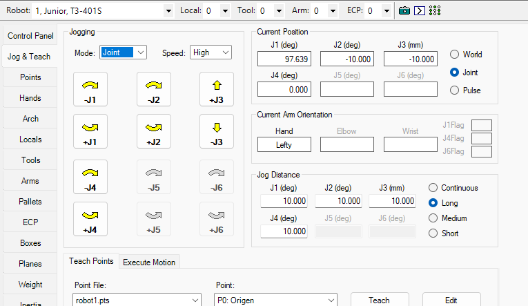 
  
- **Cartesian/Tool/World Mode (modo cartesiano):** se mueve el efector final en los ejes X, Y, Z o se aplica rotación sobre el eje U o la herramienta. En EPSON RC+ se selecciona la pestaña [Jog & Teach] → desplegable “Mode” → Joint / World / Tool.
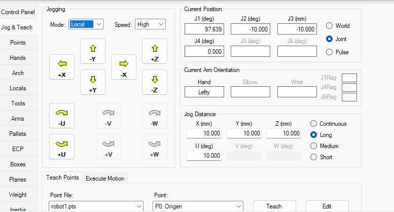

### Ejecución de traslaciones y rotaciones  
- Traslaciones: en modo cartesiano, pulsar X+, X- para mover en X, Y+, Y- para Y, Z+, Z- para Z.  
- Rotaciones: pulsar U+ / U- (o RU+/RU-) dependiendo de la interfaz para rotación de herramienta o eje U.  
- En modo articulaciones: pulsar J1+, J1- etc. para ajustar cada articulación.  
- Para movimientos más precisos se puede usar “step jog” (distancia fija por pulsación) o “continuous jog” (movimiento continuo mientras se mantiene la tecla). En EPSON RC+ se configura el “Jog Distance” y “Jog Speed”.
- Recomendación: antes de mover transversalmente, elevar el eje Z a una altura de aproximación segura para evitar colisiones.

## 4) Niveles de velocidad para movimientos manuales en EPSON RC+ 7.5.2

El robot EPSON T3-401S permite ajustar la velocidad de movimiento manual (**Jogging**) desde el software **EPSON RC+ 7.5.2** o desde el teach pendant (cuando está disponible). Estos niveles afectan únicamente el modo **TEACH**, donde el desplazamiento está deliberadamente limitado por razones de seguridad.

### Tipos de velocidades disponibles (Jog Speed)
En EPSON RC+ 7.5.2 los movimientos manuales utilizan únicamente **dos niveles de velocidad**:

- **Low** → velocidad baja y controlada, recomendada para ajustes cercanos a objetos, enseñanza precisa de puntos y aproximaciones.
- **High** → velocidad elevada dentro del modo TEACH.  
  No tiene un valor fijo ni un límite preestablecido, sino que permite aproximarse al máximo permitido por el sistema en modo seguro. El software limita automáticamente la velocidad para evitar movimientos bruscos.

> A diferencia de otros controladores, el T3-401S **no incluye nivel Medium** en RC+ y adicionalmente el nivel de velocidad afecta tanto al modo **Joint** (movimiento por articulaciones J1–J4) como al modo **Cartesian / Local / World** (movimientos en X, Y, Z, U).

---

### Cambiar los niveles de velocidad en EPSON RC+ 7.5.2

1. Abrir **EPSON RC+ 7.5.2** y conectarse al robot mediante  
   **Setup → PC to Controller Communications → USB Controller → Connect**.
2. Activar los motores: **Motor ON**.
3. Ingresar a la pestaña:  
   **Jog & Teach**.
4. En el panel “Jogging”, ubicar el campo **Speed**.
5. Seleccionar:
   - **Low**
   - **High**
    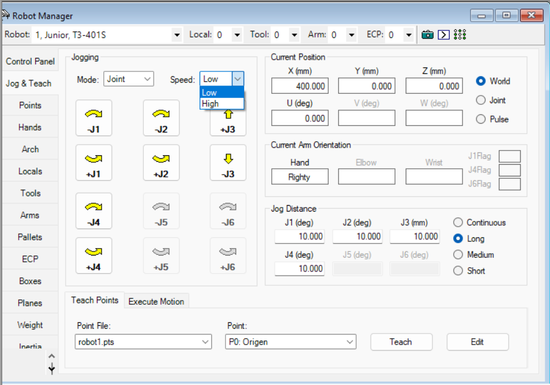
6. Comenzar a mover el robot con los botones de Jog en:
   - **Joint mode**  
   - **Local / World (cartesiano)**  
   - **Tool mode**

El cambio de velocidad es inmediato y afecta todos los vectores de movimiento.

###  Cómo verificar el nivel de velocidad actual
El nivel activo se puede identificar fácilmente:

#### **En EPSON RC+ 7.5.2**
- En la ventana **Jog & Teach**, en el menú desplegable **Speed**, se muestra el nivel seleccionado (“Low” o “High”).
- El botón se resalta al ser seleccionado.
- El robot también refleja la velocidad en el indicador de estado superior, mostrando que está en **modo TEACH** y con **Jog Speed** activo.

#### **En el Teach Pendant**
- En robots que cuentan con pendante, aparece el indicador **Jog Speed: Low/High** en pantalla.
- La selección se realiza desde los botones del menú Jog.

## 5) Funcionalidades principales de EPSON RC+ 7.5.2 y comunicación con el manipulador

EPSON RC+ 7.x es el software oficial para programación, control, simulación y gestión de robots EPSON, incluyendo el T3-401S. Actúa como la interfaz central entre el usuario, el controlador del robot y los procesos internos de ejecución. Su diseño integra programación en SPEL+, simulación 3D, herramientas de calibración y monitoreo en tiempo real.

### 5.1 Comunicación con el manipulador
EPSON RC+ se comunica directamente con el controlador del robot (RC90/RC700, según modelo) usando dos protocolos principales:

- **USB Directo (modo Controller USB):**  
  Conexión punto a punto entre el PC y el controlador del robot. Recomendado para trabajo en laboratorio, ya que es inmediato y no requiere configuración de red.

- **Ethernet / TCP-IP:**  
  Usado en entornos industriales para comunicación remota, celdas más grandes o integración con PLCs.

Una vez establecida la conexión, el software permite:
- Activar/desactivar motores,
- Leer estados del robot (posición, flags, sensores),
- Enviar comandos de movimiento en tiempo real (Jog),
- Descargar programas SPEL+ al controlador,
- Ejecutar, pausar o detener rutinas directamente desde el PC.

El controlador del robot actúa como “cerebro” de tiempo real:  
**EPSON RC+ envía comandos → el controlador los ejecuta → el robot se mueve.**

### 5.2 Principales funcionalidades del software EPSON RC+ 7.x

#### ** 5.2.1 Programación en SPEL+**
El software incluye un entorno de desarrollo completo (IDE) para crear programas en **SPEL+**, el lenguaje oficial de EPSON.  
Permite:
- Scrpting estructurado (IF, WHILE, funciones),
- Definición de puntos, poses y trayectorias,
- Control de E/S digitales,
- Gestión de errores y rutinas de seguridad.

Los programas se ejecutan directamente en el controlador del robot.

---

#### **5.2.2. Jog & Teach (Movimiento manual y enseñanza de puntos)**
La ventana **Jog & Teach** permite:
- Mover el robot en modo manual (Joint, Local, World, Tool),
- Cambiar velocidad (Low/High),
- Enseñar puntos y guardarlos en archivos `.pts`,
- Ejecutar trayectorias directamente,
- Ver posición actual en grados, mm, pulsos o coordenadas cartesianas.

Es la herramienta principal para preparar trayectorias reales antes de programarlas.

---

#### **5.2.3. Simulación 3D**
EPSON RC+ incorpora un simulador del manipulador:
- Simulación de movimiento en tiempo real,
- Visualización de colisiones básicas,
- Representación fiel de la cinemática del T3-401S,
- Validación previa antes de ejecutar en hardware.

Esto permite desarrollar rutinas sin necesidad de tener el robot activo todo el tiempo.

---

#### **5.2.4. Gestión de E/S (Entradas y Salidas)**
El software permite ver y manipular:
- **IO digitales** (salidas a actuadores como grippers, ventosas, válvulas),
- **IO analógicas**,
- Señales internas del robot (flags),
- Señales del controlador.

---

#### **5.2.5. Herramientas de configuración del robot**
Incluye módulos para:
- Configurar herramientas (Tool Frames),
- Locales (User Frames),
- Zonas de trabajo y límites (XYZ Limits),
- Ajustes de brazo (Hands, Arms),
- Parámetros internos del controlador,
- Configuración del Home y referencia en pulsos del encoder.

---

#### **5.2.6. Monitoreo del robot en tiempo real**
EPSON RC+ muestra:
- Posición actual del robot (J1–J4, XYZ, U),
- Velocidad actual,
- Estado de los motores (ON/OFF),
- Estado de seguridad (Emergency Stop, Safeguard),
- Modo (TEACH / AUTO),
- Torque y Power Level (LOW / HIGH).

---

#### **5.2.7. Ejecución de programas**
El software permite ejecutar programas SPEL+ directamente desde la PC:
- Ejecutar paso a paso,
- Ejecutar completo,
- Configurar velocidad del programa,
- Pausar, detener e inspeccionar errores.

La ejecución real ocurre en el **controlador**, no en el PC.  
El PC solo envía el programa y monitorea la ejecución.

---

### 5.3 Proceso completo para ejecutar movimientos desde EPSON RC+
1. **Conectar el PC al robot** vía USB o Ethernet.  
2. **Motor ON** y selección de potencia (Power Low / Power High).  
3. **Modo TEACH** para:
   - Jog manual,
   - Configuración de puntos,
   - Calibración o modificación de trayectorias.
4. **Modo AUTO** para ejecutar rutinas programadas.  
5. El controlador interpreta las instrucciones SPEL+:
   - Cálculo cinemático,
   - Planeación de trayectoria,
   - Control de velocidad y aceleración,
   - Envío de comandos a cada articulación.
6. El robot se mueve según la trayectoria planificada.  
7. EPSON RC+ muestra en tiempo real el estado de la ejecución.

## 6) Análisis comparativo: EPSON RC+ 7.0 vs RoboDK vs ABB RobotStudio

| **Criterio** | **EPSON RC+ 7.0** | **RoboDK** | **ABB RobotStudio** |
|--------------|-------------------|------------|---------------------|
| **Orientación** | Software propietario para robots Epson (SPEL+, integración nativa con controladores RC700/RC90). Excelente para control directo, funciones Epson (hands, IO, fieldbus) y comunicación con el manipulador. | Software multiplataforma de simulación y programación offline para muchas marcas; muy flexible, con post-procesadores para generar código para múltiples controladores. | Herramienta de simulación y programación offline específica para ABB; gemelo digital avanzado y optimizado para robots ABB y controladores IRC5. |
| **Ventajas** | Integración completa con hardware Epson; lenguaje SPEL+ para control fino; opciones no-code (Express); soporte nativo de visión y “hands”. Ideal para trabajar con el controlador real en planta o laboratorio. | Amplia compatibilidad entre marcas; interfaz rápida para generar trayectorias; verificar zonas de trabajo; exportar programas con post-procesadores. Excelente para selección de hardware y prototipado rápido. | Gran integración con el ecosistema ABB: acceso completo al IRC5, digital twin, sincronización de datos del controlador, simulación avanzada de seguridad y ciclos. Ideal para comisionado industrial. |
| **Limitaciones** | Limitado al ecosistema Epson para funciones avanzadas; menor utilidad si necesitas simular robots de otras marcas en la misma célula. | El código generado no siempre coincide al 100% con el controlador real (depende del post-procesador). No reemplaza herramientas OEM cuando se requieren capacidades propietarias muy específicas. | Solo trabaja con robots ABB. Si en tu célula tienes Epson o Yaskawa, RobotStudio no ofrece integración nativa. |
| **Aplicaciones ideales** | Implementación en planta con robots Epson, integración con E/S y visión, enseñanza de puntos y control preciso. | Prototipado general, comparación entre robots, creación de trayectorias offline y simulación rápida multiplataforma. | Comisionado industrial con ABB, digital twin completo, validación de seguridad y análisis de ciclo para robots ABB. |

---
### 7) Diseño técnico del gripper neumático por vacío.

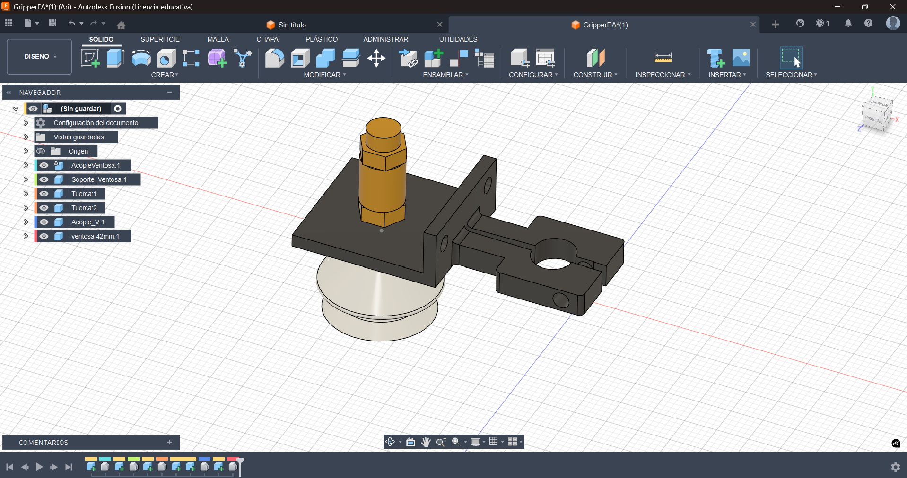
Se diseño un gripper en el software fusion, teniendo en cuenta las medidas de las chupas dadas por el laboratorio y a su vez el flange del robot, las dimensiones del gripper se ven en el plano más abajo. 

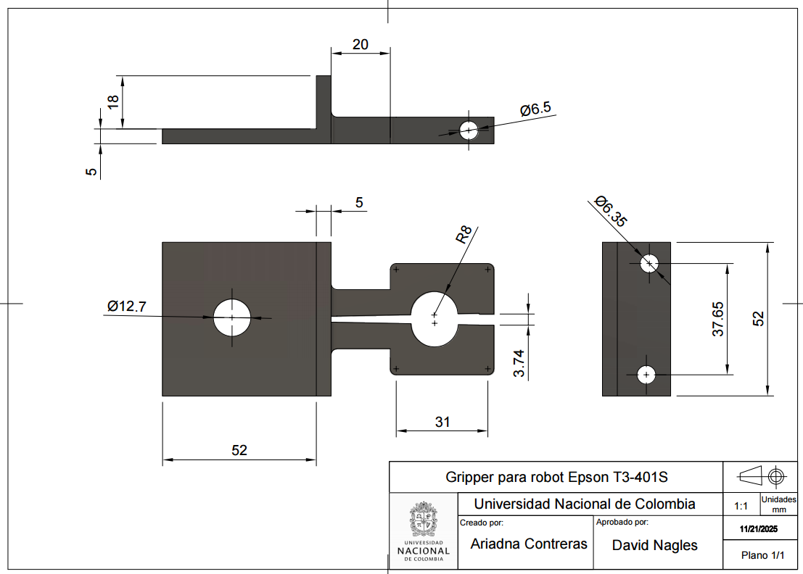

Posteriormente se exportó el archivo en .stl y se imprimio en 3D con filamento PLA, tambien se compro un tornillo para poder sujetarlo al robot, a continuación se deja el montaje fisico realizado.

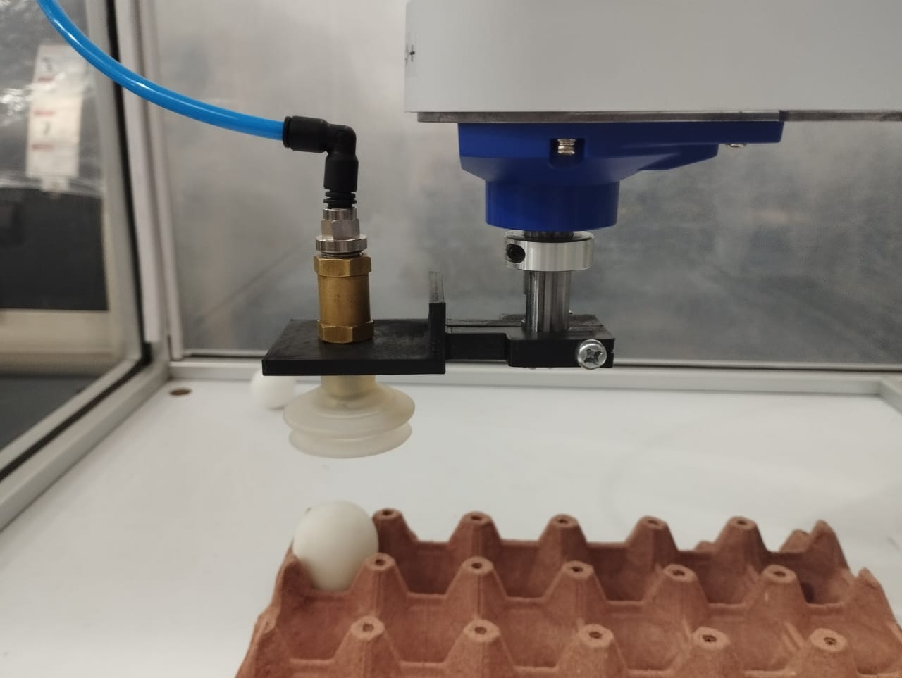

En este caso solo se uso una salida digital denominada Out_9 creada en el controlador virtual y en el controlador real del robot, que era la encargada de controlar la succión del huevo.

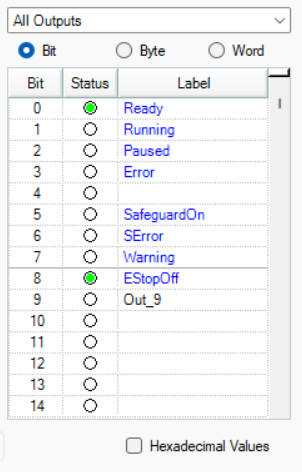

## 8) Diagrama de flujo – Rutina de movimiento con patrón de caballo

La siguiente figura muestra el flujo lógico completo del proceso de manipulación de huevos utilizando el patrón de movimiento tipo “caballo de ajedrez”. Este diagrama resume de manera clara cómo el robot toma un huevo, lo mueve desde su posición actual hasta la posición destino, y repite este proceso para dos rutas distintas en un ciclo controlado. Es una representación conceptual del comportamiento del programa SPEL+ implementado en EPSON RC+, sin incluir código, solo la lógica funcional del proceso.

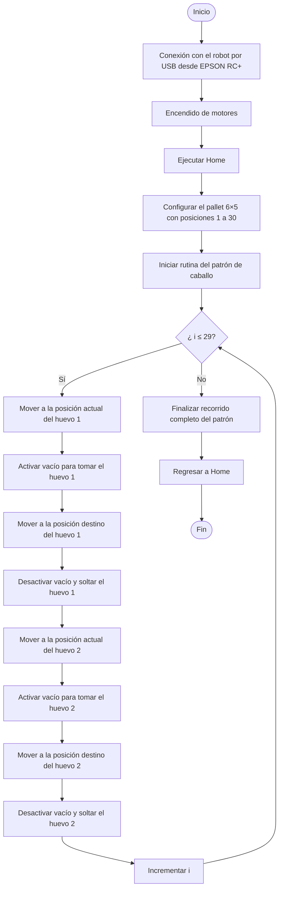
## 8) Plano de planta de la ubicación de la cubeta de huevos y posiciones iniciales de los huevos.

La siguiente figura muestra la disposición espacial del pallet de 6×5 utilizado en el laboratorio, incluyendo la ubicación del punto de referencia **Origen**, así como los puntos **PuntoX** y **PuntoY** usados por el robot para definir la orientación y el escalado del pallet. Se ilustran también las posiciones iniciales de los huevos 1 y 2 antes de iniciar la rutina del patrón de caballo, lo que permite visualizar claramente el punto de partida de cada trayectoria dentro de la matriz de 30 celdas, tambien se presentan los puntos definidos en el software como Origen, puntoX, puntoY.

### Puntos definidos para el pallet:
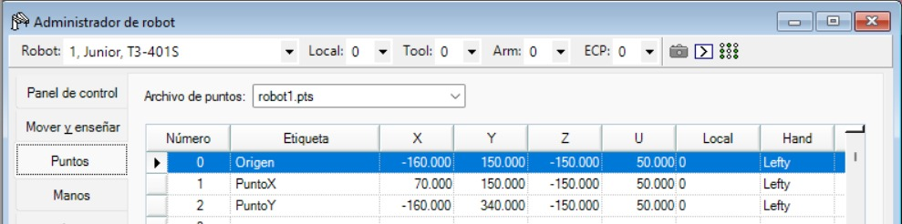
Los anteriores valores cambian con respecto a la realidad, en cuanto la altura en Z, pues para la implementación en la vida real todos los puntos usan un valor de -152.

### Posiciones iniciales de los huevos
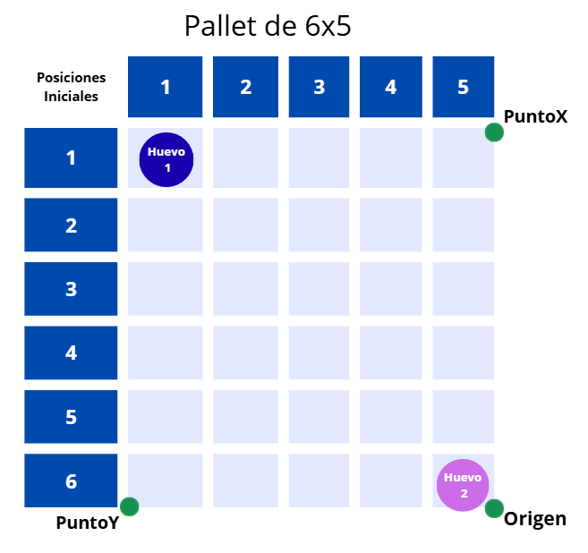

### Plano de planta

Adicionalmente, se presenta el plano de planta donde se observa la ubicación del robot y la disposición de la cubeta de huevos dentro del espacio de trabajo. Este esquema permite identificar la orientación real del manipulador respecto al pallet, así como la relación entre las referencias espaciales usadas para la programación y el entorno físico del laboratorio.

### Vista lateral
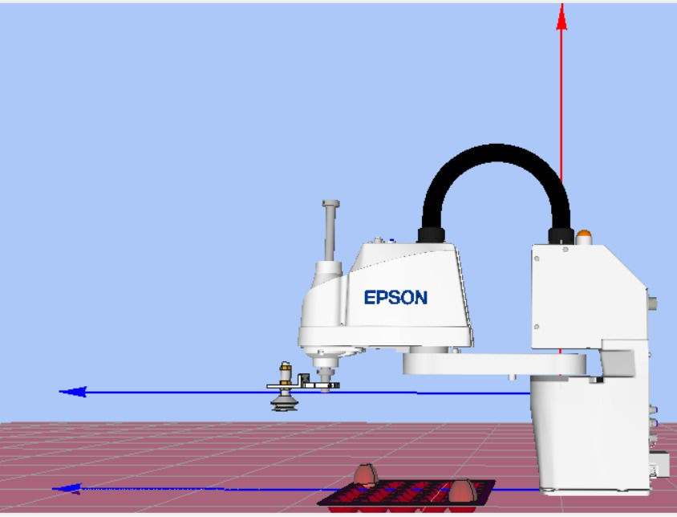

### Vista superior
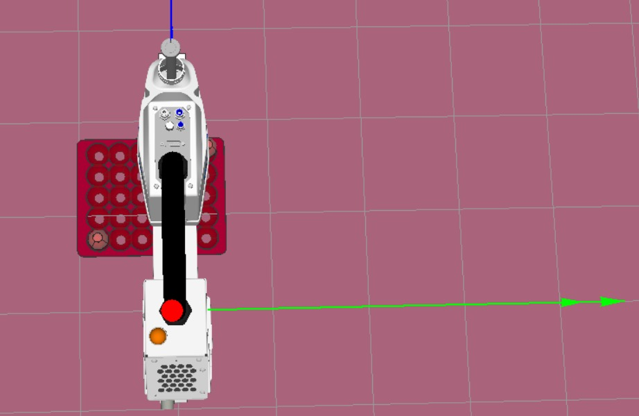

## 9) Código desarrollado en EPSON RC+ 7.5.2 para ejecutar la trayectoria con patrón de caballo

El código que implementa la trayectoria con patrón de caballo fue desarrollado en EPSON RC+ 7.0 utilizando el lenguaje SPEL+.

Se presenta solamente el código en un archivo, denominado **codigo_huevos.txt**, con, configuración del pallet y ejecución del movimiento de los dos huevos siguiendo el patrón predeterminado. Sin embargo para asegurar la correcta ejecución y reproducibilidad de la simulación, se recomienda descargar la carpeta completa **Junior_Lab3**, donde se incluyen todos los puntos, configuraciones y recursos necesarios del proyecto.

- [Junior_Lab3.zip](simulation/Junior_Lab3.zip)  
  Contiene todo el proyecto completo exportado desde EPSON RC+.

- [codigo_huevos.txt](simulation/codigo_huevos.txt)  
  Archivo con el código SPEL+ que implementa la trayectoria con patrón de caballo.

## 10) Video de la simulación en EPSON RC+ del programa de movimiento de huevos

## 11) Video de la implementación real en el manipulador EPSON T3-401S del Laboratorio

La siguiente evidencia corresponde a la implementación física del programa cargado en el manipulador EPSON T3-401S. En el video se observa la ejecución real del patrón de movimiento tipo caballo aplicado al pallet de 6×5, validando el funcionamiento del código desarrollado en EPSON RC+ 7.5.2 y confirmando la correcta sincronización entre los movimientos del robot y el sistema de vacío, ahí mismo tambien se evidencia el gripper neumático levantando un huevo de manera segura.

Video demostrativo del robot ejecutando el patrón de caballo:  

➡️ [Ver implementación en YouTube](https://www.youtube.com/watch?v=oPb9vg-Ojd0)
